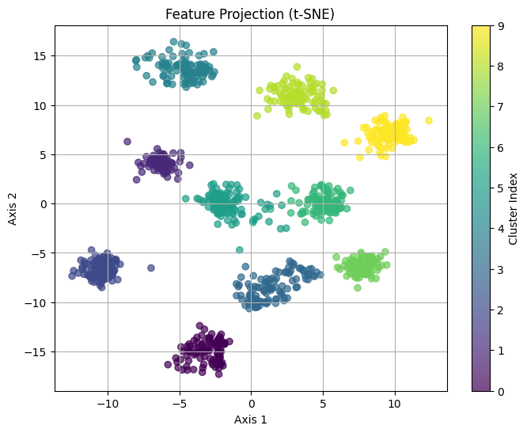

### **README.md**

# 🚀 JAX-based t-SNE: Vectorized & GPU-Accelerated  
This repository contains a fully **vectorized** and **GPU-enabled** implementation of **t-SNE (t-Distributed Stochastic Neighbor Embedding)** in JAX. It efficiently maps **high-dimensional data to lower-dimensional manifolds** while leveraging **JAX’s auto-differentiation** and **XLA compilation** for speed.  

## **Features**
✅ **Fully Vectorized:** No loops, everything optimized using JAX operations.  
✅ **GPU & TPU Acceleration:** Powered by JAX’s **XLA compiler**, making it blazing fast.  
✅ **PCA Initialization:** Supports PCA-based embedding initialization.  
✅ **Binary Search for Perplexity:** Uses **adaptive bandwidth selection** for probability matrix `P`.  
✅ **Automatic Differentiation:** Uses `jax.grad` for efficient KL divergence minimization.  

---

## **Installation**
Ensure you have JAX installed with GPU support:
```bash
pip install jax jaxlib matplotlib
```
If using **CUDA-enabled JAX**, install:
```bash
pip install jaxlib -f https://storage.googleapis.com/jax-releases/jax_cuda_releases.html
```

---

## **Usage**
### **Basic Example**
```python
import jax
import jax.numpy as jnp
from tsne import TSNE  # Import the implementation

# Generate random dataset (multimodal)
key = jax.random.PRNGKey(42)
x = jax.random.normal(key, shape=(300, 10))

# Run t-SNE
tsne = TSNE(x, n_components=2, learning_rate=10.0, perplexity=30)
losses = tsne.fit(verbose=True)

# Get embeddings
y_tsne = tsne.y
```

---

## **Implementation Details**
### **1️⃣ Probability Distribution (`P`)**
- Computes **pairwise affinities** using a **Gaussian Kernel**.
- Adaptive bandwidth is found using **binary search**, ensuring a **target perplexity**.  
```python
p = TSNE.compute_p(norm, sig)
```

### **2️⃣ Probability Distribution (`Q`)**
- Uses a **Student-t distribution** in lower-dimensional space.
- Avoids numerical instability with regularization (`+1e-8`).  
```python
q = TSNE.compute_q(y)
```

### **3️⃣ KL Divergence Loss**
- Optimized using `jax.grad` to compute gradients efficiently.
- Fully **JIT-compiled** for GPU acceleration.
```python
kl_div = TSNE.kl_divergence(y, p)
```

### **4️⃣ Training Loop**
- Iteratively updates `y` using **gradient descent**.
- Tracks **loss** and **gradient norms** for debugging.
```python
for i in range(self.max_iter):
    kl_div_val, y, grad = self.update(y, p, self.learning_rate)
```

---

## **📊 PCA vs t-SNE Visualization**
This comparison shows **PCA vs t-SNE vs  SKLearn-t-SNE**


---

## **🚀 Performance Benefits with JAX**
✅ **JIT Compilation:** Speeds up repeated computations.  
✅ **Vectorized Updates:** Uses **jax.numpy** for parallel operations.  
✅ **GPU Support:** Runs seamlessly on **TPUs and CUDA GPUs**.  

#### **Performance Gains**

| Method              | Execution Time (seconds) | Speedup |
|---------------------|------------------------|---------|
| **JAX t-SNE (ours)**  | **0.145 s**            | **~10.3x faster** |
| Scikit-learn t-SNE  | **1.49 s**              | -       |


## **🔧 TODO & Improvements**
- 🔲 Support **t-SNE with early exaggeration phase**.  
- 🔲 Add **mini-batch t-SNE** for large datasets.  
- 🔲 Implement **alternative optimization methods (Adam, RMSprop)**.  

---

## **📜 References**
- [https://github.com/beaupletga/t-SNE](https://github.com/beaupletga/t-SNE)  
- [https://github.com/robkravec/t-SNE-Implementation](https://github.com/robkravec/t-SNE-Implementation)  
- [https://jax.readthedocs.io/en/latest](https://jax.readthedocs.io/en/latest)  
- [https://github.com/scikit-learn/scikit-learn](https://github.com/scikit-learn/scikit-learn)  

---

## **📬 Contact**
For any issues, feel free to open an **Issue** or reach out! 🚀
